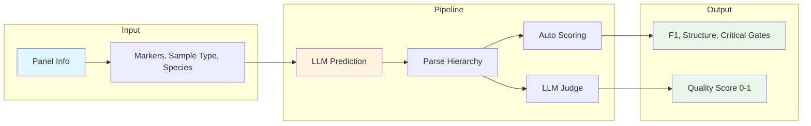
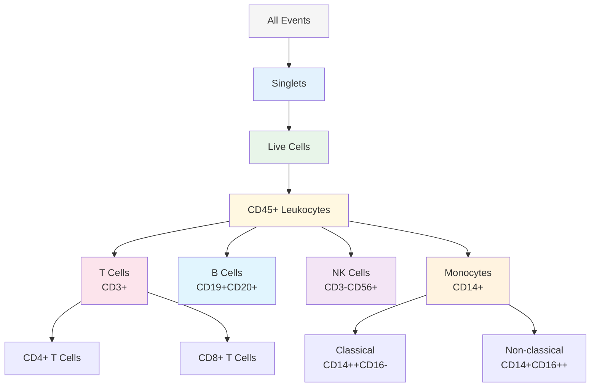
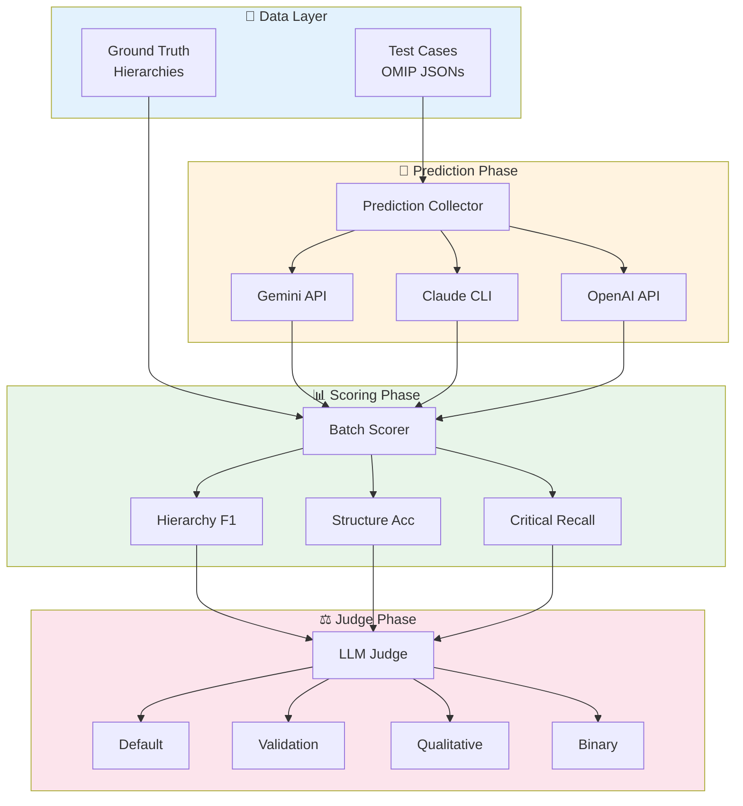

# Flow Gating Benchmark

Evaluate LLM capabilities in predicting flow cytometry gating strategies from panel information.

> **Status:** Active development. 10 verified test cases, 13 pending curation. Results may be rerun as data quality improves.

## Key Finding

**gemini-2.5-pro leads at 0.36 F1, but F1 is a flawed metric** - it penalizes biologically correct predictions that use different naming conventions. LLM judge evaluation shows models reason about gating structure rather than memorizing terminology (R² = 0.034 for frequency correlation).

See [docs/DETAILED_RESULTS.md](docs/DETAILED_RESULTS.md) for full analysis.

---

## Results

### Model Performance

```
F1 Score (↑ better)                              Judge Quality (↑ better)

gemini-2.5-pro   ████████████████████████ 0.361   ██████████████████████████████ 0.59
gemini-2.0-flash ██████████████████████▌  0.340   █████████████████████▌         0.41
claude-opus-4    █████████████████████▌   0.330   ██████████████████████████▌    0.52
claude-sonnet-4  █████████████████████    0.326   ████████████████████▌          0.39
claude-haiku-3.5 ████████████████████     0.306   █████████████████▌             0.34
gemini-2.5-flash ████████████████████     0.305   ██████████████████████████     0.51
```

**Recommendations:**
- **Best quality:** gemini-2.5-pro (highest F1 + judge scores)
- **Best value:** gemini-2.0-flash (high consistency, lowest cost)
- **Include HIPC reference** for +5.6% F1 improvement

---

## How It Works



---

## Example

**Input:** OMIP-077 panel (20 markers for human PBMC immunophenotyping)

```
Panel: CD3, CD4, CD8, CD14, CD16, CD19, CD20, CD45, CD56, CD66b,
       CD123, CD141, HLA-DR, Viability, FSC-A, FSC-H, SSC-A...
```

**Predicted Gating Hierarchy (gemini-2.5-pro):**



**Evaluation:**

| Metric | Score | Interpretation |
|--------|:-----:|----------------|
| Hierarchy F1 | 0.38 | String matching penalizes "(CD3+)" suffix |
| Judge Quality | 0.72 | Recognizes biological correctness |
| Critical Gate Recall | 1.00 | Singlets + Live present |

---

## Quick Start

```bash
# Install
pip install -r requirements.txt

# Run benchmark (1 test case, ~$0.01)
python scripts/run_modular_pipeline.py \
    --phase all \
    --models gemini-2.0-flash \
    --max-cases 1

# Full benchmark (~$50)
python scripts/run_modular_pipeline.py \
    --phase all \
    --models gemini-2.0-flash gemini-2.5-pro opus sonnet haiku \
    --test-cases data/verified \
    --n-bootstrap 3
```

---

## Pipeline Architecture



---

## CLI Reference

```bash
python scripts/run_modular_pipeline.py [OPTIONS]
```

| Option | Default | Description |
|--------|---------|-------------|
| `--phase` | `all` | `predict`, `score`, `judge`, or `all` |
| `--models` | `claude-sonnet-cli` | Models to test (space-separated) |
| `--test-cases` | `data/verified` | Test case JSON directory |
| `--n-bootstrap` | `1` | Runs per condition (use 3+ for variance) |
| `--max-cases` | None | Limit test cases (for testing) |
| `--judge-model` | `gemini-2.5-pro` | Model for qualitative judge |
| `--dry-run` | False | Mock API calls |

---

## Project Structure

```
flow_gating_benchmark/
├── src/
│   ├── curation/           # Test case schemas
│   ├── evaluation/         # Scoring (F1, structure, normalization)
│   ├── experiments/        # Pipeline (collector, scorer, judge)
│   └── analysis/           # Hypothesis testing
├── data/
│   ├── verified/           # 10 curated test cases
│   └── staging/            # 13 pending verification
├── scripts/
│   └── run_modular_pipeline.py
├── docs/
│   └── DETAILED_RESULTS.md # Full analysis
└── tests/
```

---

## Environment

```bash
# Required
GOOGLE_API_KEY=...     # Gemini models + judge

# Optional (CLI models use Max subscription)
ANTHROPIC_API_KEY=...
OPENAI_API_KEY=...
```

---

## Documentation

| Document | Description |
|----------|-------------|
| [docs/DETAILED_RESULTS.md](docs/DETAILED_RESULTS.md) | Full benchmark analysis, methodology, frequency confound study |
| [CLAUDE.md](CLAUDE.md) | Claude Code instructions |
| [TODO.md](TODO.md) | Task tracking |

---

## License

MIT
