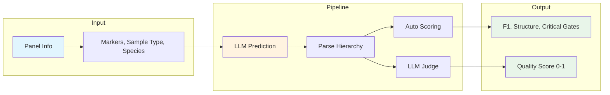
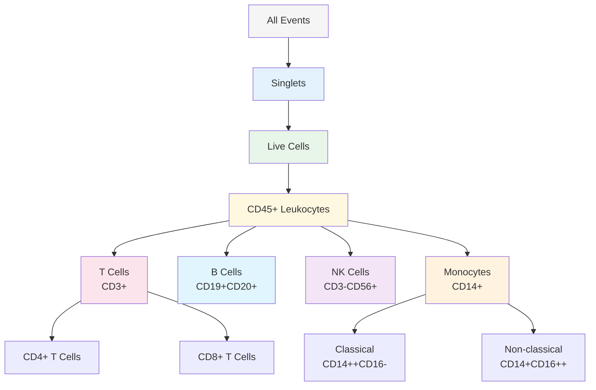
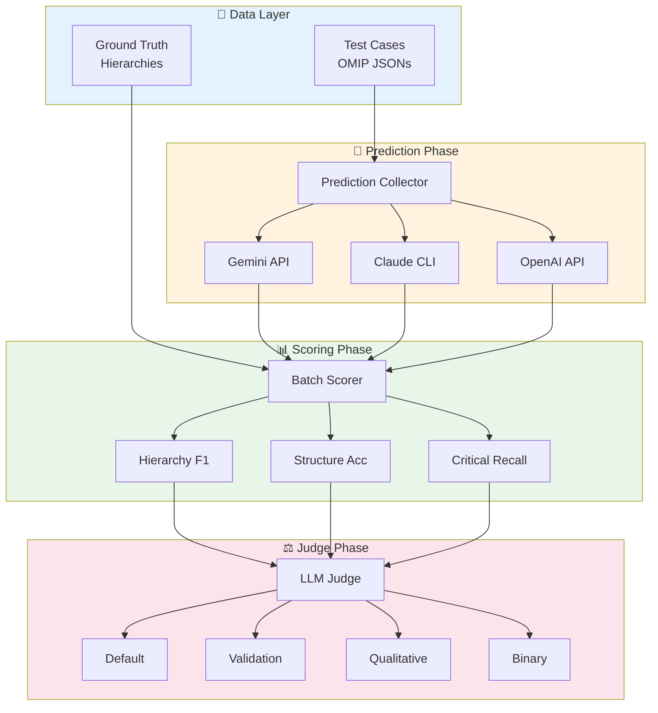

# Flow Gating Benchmark

Evaluate LLM capabilities in predicting flow cytometry gating strategies from panel information.

> **Status:** Active development. 10 verified test cases, 18 pending curation. Results may be rerun as data quality improves.

## Key Finding

**gemini-2.5-pro leads at 0.36 F1, but F1 is a flawed metric** - it penalizes biologically correct predictions that use different naming conventions. LLM judge evaluation shows models reason about gating structure rather than memorizing terminology.

**Frequency Confound Update:** Initial R² = 0.06 (exact match PubMed) suggested weak correlation. After synonym aggregation, **R² = 0.36** — frequency explains ~36% of variance. The exact-match method severely underestimates the true frequency effect. See [docs/DETAILED_RESULTS.md](docs/DETAILED_RESULTS.md) for full analysis.

---

## Results

### Model Performance

```
F1 Score (↑ better)                              Judge Quality (↑ better)

gemini-2.5-pro   ████████████████████████ 0.361   ██████████████████████████████ 0.59
gemini-2.0-flash ██████████████████████▌  0.340   █████████████████████▌         0.41
claude-opus-4    █████████████████████▌   0.330   ██████████████████████████▌    0.52
claude-sonnet-4  █████████████████████    0.326   ████████████████████▌          0.39
claude-haiku-3.5 ████████████████████     0.306   █████████████████▌             0.34
gemini-2.5-flash ████████████████████     0.305   ██████████████████████████     0.51
```

**Recommendations:**
- **Best quality:** gemini-2.5-pro (highest F1 + judge scores)
- **Best value:** gemini-2.0-flash (high consistency, lowest cost)
- **Include HIPC reference** for +5.6% F1 improvement

---

## How It Works


```mermaid
flowchart LR
    subgraph Input
        A[Panel Info] --> B[Markers, Sample Type, Species]
    end

    subgraph Pipeline
        B --> C[LLM Prediction]
        C --> D[Parse Hierarchy]
        D --> E[Auto Scoring]
        D --> F[LLM Judge]
    end

    subgraph Output
        E --> G[F1, Structure, Critical Gates]
        F --> H[Quality Score 0-1]
    end

    style A fill:#e1f5fe
    style C fill:#fff3e0
    style G fill:#e8f5e9
    style H fill:#e8f5e9
```

---

## Example

**Input:** OMIP-077 panel (20 markers for human PBMC immunophenotyping)

```
Panel: CD3, CD4, CD8, CD14, CD16, CD19, CD20, CD45, CD56, CD66b,
       CD123, CD141, HLA-DR, Viability, FSC-A, FSC-H, SSC-A...
```

**Predicted Gating Hierarchy (gemini-2.5-pro):**


```mermaid
graph TD
    A[All Events] --> B[Singlets]
    B --> C[Live Cells]
    C --> D[CD45+ Leukocytes]

    D --> E[T Cells<br/>CD3+]
    D --> F[B Cells<br/>CD19+CD20+]
    D --> G[NK Cells<br/>CD3-CD56+]
    D --> H[Monocytes<br/>CD14+]

    E --> E1[CD4+ T Cells]
    E --> E2[CD8+ T Cells]

    H --> H1[Classical<br/>CD14++CD16-]
    H --> H2[Non-classical<br/>CD14+CD16++]

    style A fill:#f5f5f5
    style B fill:#e3f2fd
    style C fill:#e8f5e9
    style D fill:#fff8e1
    style E fill:#fce4ec
    style F fill:#e1f5fe
    style G fill:#f3e5f5
    style H fill:#fff3e0
```

**Evaluation:**

| Metric | Score | Interpretation |
|--------|:-----:|----------------|
| Hierarchy F1 | 0.38 | String matching penalizes "(CD3+)" suffix |
| Judge Quality | 0.72 | Recognizes biological correctness |
| Critical Gate Recall | 1.00 | Singlets + Live present |

---

## Quick Start

```bash
# Install
pip install -r requirements.txt

# Run benchmark (1 test case, ~$0.01)
python scripts/run_modular_pipeline.py \
    --phase all \
    --models gemini-2.0-flash \
    --max-cases 1

# Full benchmark (~$50)
python scripts/run_modular_pipeline.py \
    --phase all \
    --models gemini-2.0-flash gemini-2.5-pro opus sonnet haiku \
    --test-cases data/verified \
    --n-bootstrap 3
```

---

## Pipeline Architecture


```mermaid
flowchart TB
    subgraph Data["📁 Data Layer"]
        TC[Test Cases<br/>OMIP JSONs]
        GT[Ground Truth<br/>Hierarchies]
    end

    subgraph Predict["🤖 Prediction Phase"]
        PC[Prediction Collector]
        LLM1[Gemini API]
        LLM2[Claude CLI]
        LLM3[OpenAI API]
        PC --> LLM1 & LLM2 & LLM3
    end

    subgraph Score["📊 Scoring Phase"]
        BS[Batch Scorer]
        F1[Hierarchy F1]
        ST[Structure Acc]
        CR[Critical Recall]
        BS --> F1 & ST & CR
    end

    subgraph Judge["⚖️ Judge Phase"]
        LJ[LLM Judge]
        J1[Default]
        J2[Validation]
        J3[Qualitative]
        J4[Binary]
        LJ --> J1 & J2 & J3 & J4
    end

    TC --> PC
    GT --> BS
    LLM1 & LLM2 & LLM3 --> BS
    F1 & ST & CR --> LJ

    style Data fill:#e3f2fd
    style Predict fill:#fff3e0
    style Score fill:#e8f5e9
    style Judge fill:#fce4ec
```

### Recent Additions

- **Enhanced Normalization**: ~200 cell type synonyms, marker aliases (CCR7=CD197), hierarchical matching
- **Structure Error Analysis**: Categorizes errors as WRONG_PARENT, MISSING_GATE, SWAPPED_RELATIONSHIP, WRONG_DEPTH
- **Biological Context Awareness**: Hard constraints (lineage exclusivity), soft constraints (CD45 optional for PBMCs)
- **Multi-Judge Cross-Validation**: Multiple prompt styles for LLM judge reliability
- **Token Breakdown Analysis**: Track thinking vs response tokens for reasoning models
- **Blocked Prediction Recovery**: `scripts/rerun_blocked.py` for MAX_TOKENS failures

---

## CLI Reference

```bash
python scripts/run_modular_pipeline.py [OPTIONS]
```

| Option | Default | Description |
|--------|---------|-------------|
| `--phase` | `all` | `predict`, `score`, `judge`, or `all` |
| `--models` | `claude-sonnet-cli` | Models to test (space-separated) |
| `--test-cases` | `data/verified` | Test case JSON directory |
| `--n-bootstrap` | `1` | Runs per condition (use 3+ for variance) |
| `--max-cases` | None | Limit test cases (for testing) |
| `--judge-model` | `gemini-2.5-pro` | Model for qualitative judge |
| `--dry-run` | False | Mock API calls |

---

## Project Structure

```
flow_gating_benchmark/
├── src/
│   ├── curation/              # Test case schemas
│   │   ├── schemas.py         # TestCase, Panel, GatingHierarchy
│   │   └── omip_extractor.py
│   ├── evaluation/            # Scoring
│   │   ├── metrics.py         # F1, structure, hallucination
│   │   ├── normalization.py   # 200+ gate synonyms
│   │   ├── enhanced_normalization.py  # Marker aliases, hierarchical matching
│   │   ├── hierarchy.py       # Tree operations
│   │   ├── task_failure.py    # Refusal detection
│   │   ├── response_parser.py
│   │   └── scorer.py
│   ├── experiments/           # Pipeline
│   │   ├── prediction_collector.py
│   │   ├── batch_scorer.py
│   │   ├── llm_judge.py       # Multi-judge support
│   │   ├── llm_client.py      # Gemini, Claude, OpenAI
│   │   ├── conditions.py
│   │   └── prompts.py
│   └── analysis/              # Hypothesis testing
│       ├── alien_cell.py      # Frequency confound tests
│       └── cognitive_refusal.py
├── data/
│   ├── verified/           # 10 curated test cases
│   └── staging/            # 18 pending verification
├── scripts/
│   ├── run_modular_pipeline.py
│   ├── rerun_blocked.py       # Recover MAX_TOKENS failures
│   ├── analyze_structure_errors.py     # Error categorization
│   ├── analyze_with_biological_context.py  # Context-aware analysis
│   └── analyze_judge_vs_rules.py       # Judge vs F1 comparison
├── results/
│   ├── BENCHMARK_RESULTS_SUMMARY.md  # Latest results
│   └── gemini_benchmark_predictions.json
├── docs/
│   └── DETAILED_RESULTS.md # Full analysis
└── tests/
```

---

## Environment

```bash
# Required
GOOGLE_API_KEY=...     # Gemini models + judge

# Optional (CLI models use Max subscription)
ANTHROPIC_API_KEY=...
OPENAI_API_KEY=...
```

---

## Documentation

| Document | Description |
|----------|-------------|
| [docs/DETAILED_RESULTS.md](docs/DETAILED_RESULTS.md) | Full benchmark analysis, methodology, frequency confound study |
| [CLAUDE.md](CLAUDE.md) | Claude Code instructions |
| [TODO.md](TODO.md) | Task tracking |

---

## License

MIT
